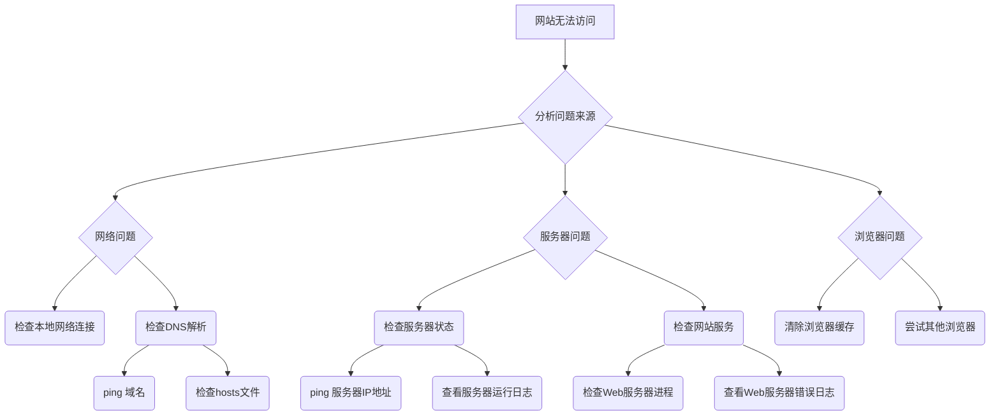

# 目标

测试排查图的增量变更方案是否可行

# 第一轮对话

提示词:

````
我在解决一个问题, 梳理了一个思考过程
 
<问题>
人类：MySQL在执行select语句的时候crash，应该如何排查？
</问题>
 
 
<思考过程>
## MySQL 执行 select 语句时 Crash 的排查训练流程
 
------
 
### 对问题的信息进行分析
 
[对问题的信息进行分析]  目前的信息非常有限，只知道 MySQL 在执行 select 语句时 crash，具体表现、crash 日志、系统环境等信息一概不知。
 
------
 
### 需要更多信息
 
[需要更多信息]
- MySQL 版本
- 操作系统版本
- 发生 crash 时的错误日志信息
- 导致 crash 的具体 select 语句
- 表结构和数据量
- crash 发生的频率
- 数据库最近是否进行过变更操作（例如升级、配置修改、DDL 等）
 
[原因]
这些信息是排查问题的重要线索，可以帮助我们缩小问题范围，更快地定位问题根源。
 
[如何利用这些信息让答案更聚焦]
 
假设获取到以下信息：
 
- MySQL 版本: 8.0.28
- 操作系统: CentOS 7
- 错误日志信息:  Segmentation fault (core dumped)
- 导致 crash 的 select 语句:  SELECT * FROM users WHERE created_at > '2023-10-26'
- 表结构: users 表包含 id, name, created_at 等字段，数据量约 1000 万行
- crash 发生的频率:  每次执行该 select 语句都会 crash
- 数据库最近进行过变更操作:  无
 
我们可以根据这些信息进行以下推测：
 
1. **Segmentation fault** 错误通常表示内存访问错误，可能是 MySQL 代码 bug 导致的。
2.  **每次执行特定 select 语句都会 crash** 表明问题可能与该语句的执行计划、数据读取方式等有关。
3.  结合 MySQL 版本、操作系统版本、表结构和数据量等信息，我们可以缩小问题排查范围，例如查找 MySQL 8.0.28 版本在 CentOS 7 上是否存在已知 bug，或者分析该 select 语句在特定数据量和表结构下的执行计划是否存在问题。
 
------
 
### 搜索
 
[思考] 首先，我们需要了解 MySQL crash 的常见原因有哪些。
 
[原因]  了解常见原因可以帮助我们更有针对性地进行排查。
 
[输入搜索引擎的关键字]  MySQL crash 常见原因
 
[需要搜索的具体问题]
- MySQL 常见的 crash 原因有哪些？
    - [我的搜索结果]  MySQL 常见的 crash 原因包括：内存不足、磁盘空间不足、硬件故障、MySQL bug、操作系统错误、配置文件错误、查询语句错误等。
- MySQL 发生 Segmentation fault 错误的可能原因有哪些？
    - [我的搜索结果]  MySQL 发生 Segmentation fault 错误的可能原因包括：MySQL 代码 bug、内存损坏、第三方库问题、操作系统内核问题等。
 
------
 
### 阶段性结论
 
[思考]  根据搜索结果，MySQL crash 的原因多种多样，我们需要结合具体情况进行分析。
 
[阶段性答案]  MySQL 在执行 select 语句时 crash，可能是由于多种原因导致的，例如 MySQL bug、内存错误、查询语句问题等。我们需要收集更多信息才能进行更准确的判断。
 
------
 
### 反向反思
 
[假设以上分析是错误的]  如果 crash 不是由 MySQL 本身导致的，那么可能是外部因素导致的。
 
[原因]  我们需要考虑所有可能性，排除外部因素的干扰。
 
[输入搜索引擎的关键字]  MySQL 外部因素 crash
 
[需要搜索的具体问题]
- 哪些外部因素可能导致 MySQL crash？
    - [我的搜索结果]  可能导致 MySQL crash 的外部因素包括：硬件故障（例如内存、磁盘、CPU 等）、操作系统错误（例如内核崩溃、文件系统错误等）、网络问题、其他应用程序的影响等。
 
------
 
### 我们应当给人类的回复框架
 
[我们应当给人类的回复框架]
 
1.  **人类现在处于什么情绪**:  推测为焦虑、困惑，因为数据库出现 crash 是比较严重的问题。
2.  **是否应当给出应急的手段**:  应当，例如尝试重启 MySQL 服务，如果可以恢复则先恢复服务，然后再进行问题排查。
3.  **是否应当提示人类下一步动作**:  应当，引导用户收集必要信息，例如错误日志、MySQL 版本、操作系统版本、导致 crash 的 SQL 语句等。
4.  **是否应当给出问题的解**:  不应当，因为目前信息不足，无法给出具体的解决方案，过早给出猜测性的答案可能会误导用户。
5.  **是否应当给出一些扩展的知识**:  可以，在用户收集到足够信息后，可以讲解一些 MySQL crash 的常见原因、排查思路、常用工具等知识。
6.  **在整个过程中, 是否有一些不重要的技术信息, 是不必告诉人类的**:  例如 Segmentation fault 的详细技术细节、MySQL 源代码级别的分析等，这些信息对普通用户帮助不大，反而会增加理解难度。
7.  **在整个过程中, 是否有一些重要的技术信息, 是必须告诉人类的**:  例如 crash 的严重性、数据丢失的风险、如何避免类似问题再次发生等，这些信息可以帮助用户更好地理解问题的本质，并采取必要的措施。
</思考过程>
 
我希望你能够生成一个层次结构故障排除树，用于指导用户逐步排查特定问题。

**故障排除树需要满足以下要求：**

1. **层次结构**: 从根节点（问题本身）开始，逐步深入到更具体的可能原因和排查步骤。
2. **分支逻辑**: 每个节点代表一个问题或原因，其子节点代表针对该节点的可能解决方案或更细化的排查方向。
3. **清晰易懂**:  树形结构能够清晰地展现排查思路，方便他人理解和使用。

**你可以参考以下例子：**

**问题：** 网站无法访问


```` 

排查图: 

```
 graph TD
    A[MySQL 执行 SELECT 语句时 Crash] --> B{确认问题现象}
    B --> B1(是否每次执行 SELECT 语句都 Crash？)
    B1 -- 是 --> C{分析 Crash 日志}
    B1 -- 否 --> D{分析 Crash 发生的规律}
    C --> C1(是否存在 Segmentation fault 错误？)
    C1 -- 是 --> E{排查内存问题}
    C1 -- 否 --> F{分析其他错误信息}
    D --> D1(是否特定语句导致 Crash？)
    D1 -- 是 --> G{分析语句及数据}
    D1 -- 否 --> H{排查外部因素}
    E --> E1(检查 MySQL 配置文件)
    E1 --> E11(调整 innodb_buffer_pool_size 等内存参数)
    E --> E2(检查操作系统内存使用情况)
    E2 --> E21(使用 top, free 等命令查看内存占用)
    E --> E3(排查 MySQL 代码 bug)
    E3 --> E31(搜索 MySQL 官方文档及社区)
    E3 --> E32(升级 MySQL 版本)
    F --> F1(根据错误信息搜索解决方案)
    F1 --> F11(参考 MySQL 官方文档)
    F1 --> F12(搜索网络资源)
    G --> G1(分析语句执行计划)
    G1 --> G11(使用 EXPLAIN 查看执行计划)
    G1 --> G12(优化索引)
    G --> G2(检查数据是否存在问题)
    G2 --> G21(运行 CHECK TABLE 检查表结构)
    G2 --> G22(修复或恢复数据)
    H --> H1(检查硬件设备)
    H1 --> H11(内存、CPU、磁盘等)
    H --> H2(检查操作系统)
    H2 --> H21(查看系统日志)
    H2 --> H22(更新系统补丁)
    H --> H3(检查其他应用程序)
    H3 --> H31(是否存在资源竞争)
``` 

图: [mermaid-diagram-2024-07-17-133928.svg](/assets/01KJBZAPGEQT0E9NB6C8CFG229/mermaid-diagram-2024-07-17-133928.svg)

# 第二轮对话

提示词: 

````
我在解决一个问题, 梳理了一个思考过程
  
<问题>
人类：MySQL在执行select语句的时候crash，应该如何排查？
   
人类：错误日志：```
2023-11-06T14:44:05.362128+08:00 0 [Note] /mysql/mysql57/bin/mysqld: ready for connections.
Version: '5.7.36-log' socket: '/mysqldata/mysqltmp/mysqld.sock' port: 16063 MySQL Community Server (GPL)
2023-11-06T14:44:08.710518+08:00 17 [Warning] Timeout waiting for reply of binlog (file: mysqlbinlog.002386, pos: 1397), semi-sync up to file , position 0.
2023-11-06T14:44:08.710580+08:00 17 [Note] Semi-sync replication switched OFF.
06:44:29 UTC - mysqld got signal 8 ;
This could be because you hit a bug. It is also possible that this binary
or one of the libraries it was linked against is corrupt, improperly built,
or misconfigured. This error can also be caused by malfunctioning hardware.
Attempting to collect some information that could help diagnose the problem.
As this is a crash and something is definitely wrong, the information
collection process might fail.key_buffer_size=8388608
read_buffer_size=2097152
max_used_connections=49
max_threads=1000
thread_count=50
connection_count=49
It is possible that mysqld could use up to
key_buffer_size + (read_buffer_size + sort_buffer_size)*max_threads = 6165582 K bytes of memory
Hope that's ok; if not, decrease some variables in the equation.Thread pointer: 0x7f24e0000d40
Attempting backtrace. You can use the following information to find out
where mysqld died. If you see no messages after this, something went
terribly wrong...
stack_bottom = 7f2c930fce98 thread_stack 0x40000
/mysql/mysql57/bin/mysqld(my_print_stacktrace+0x35)[0xf7b545]
/mysql/mysql57/bin/mysqld(handle_fatal_signal+0x4b9)[0x7fab89]
/lib64/libpthread.so.0(+0x134c0)[0x7f332c73d4c0]
/mysql/mysql57/bin/mysqld(decimal2bin+0x1c0)[0x1487e90]
/mysql/mysql57/bin/mysqld(_Z17my_decimal2binaryjPK10my_decimalPhii+0xc5)[0xc916a5]
/mysql/mysql57/bin/mysqld(_ZN10Sort_param12make_sortkeyEPhPKh+0x33d)[0x83bf7d]
/mysql/mysql57/bin/mysqld(Z8filesortP3THDP8FilesortbPyS3_S3+0x1852)[0x83fdc2]
```
</问题>
  
  
<思考过程>
------
[对问题的信息进行分析]  人类提供的信息是 MySQL 在执行 select 语句时崩溃，并提供了错误日志。错误日志中包含了以下关键信息：
  
*  `mysqld got signal 8`：MySQL 服务器进程接收到信号 8 (SIGFPE) 而崩溃，该信号通常表示发生了算术错误，例如除以零。
*  `Semi-sync replication switched OFF`：在崩溃前，MySQL 的半同步复制被关闭。这可能是一个重要的线索，因为半同步复制的关闭通常发生在主库和从库之间出现问题时。
*  `decimal2bin` `my_decimal2binaryjPK10my_decimalPhii`：崩溃发生在与 decimal 数据类型相关的函数调用中，这意味着问题可能与 decimal 类型的处理有关。
  
------
[思考] 首先，我们需要了解 signal 8 代表什么，以及哪些原因可能导致 MySQL 接收 signal 8 信号。
  
[原因] 错误日志中显示 MySQL 因为接收到 signal 8 而崩溃，我们需要了解这个信号的含义，才能进一步分析问题的原因。
  
[输入搜索引擎的关键字] mysql signal 8
  
[需要搜索的具体问题]
- MySQL 中 signal 8 代表什么？
    -  "Signal 8 is SIGFPE, which stands for "floating-point exception". It is usually caused by an arithmetic error, such as division by zero, overflow, or an invalid arithmetic operation."
- 哪些原因可能导致 MySQL 接收 signal 8 信号？
    -  "Possible causes of SIGFPE in MySQL include bugs in MySQL code, incompatible libraries, hardware issues (e.g., faulty CPU or memory), data corruption, and issues with user-defined functions or stored procedures that perform arithmetic operations."
  
------
[阶段性答案] MySQL 因为接收到 signal 8 (SIGFPE) 而崩溃，该信号通常表示发生了算术错误。 导致 MySQL 接收 signal 8 信号的原因有很多，例如 MySQL 代码错误、不兼容的库、硬件问题、数据损坏以及用户自定义函数或存储过程中的算术运算问题等。
  
------
[思考] 然后，我们需要结合错误日志中提到的 `decimal2bin` 和 `my_decimal2binaryjPK10my_decimalPhii` 函数，进一步分析导致 signal 8 信号的原因。
  
[原因] 错误日志中显示崩溃发生在与 decimal 数据类型相关的函数调用中，这可能是一个重要的线索。
  
[输入搜索引擎的关键字] mysql decimal2bin signal 8
  
[需要搜索的具体问题]
-  调用 `decimal2bin` 和 `my_decimal2binaryjPK10my_decimalPhii` 函数时，哪些情况下可能会出现算术错误？
    - "Arithmetic errors during the execution of `decimal2bin` and `my_decimal2binaryjPK10my_decimalPhii` functions could occur due to issues like attempting to convert an invalid decimal value to binary, overflow during the conversion process, or encountering corrupted data in a decimal column."
  
------
[阶段性答案] MySQL 在执行 select 语句时崩溃，可能是因为在调用 `decimal2bin` 和 `my_decimal2binaryjPK10my_decimalPhii` 函数进行 decimal 类型转换时发生了算术错误，例如尝试将无效的 decimal 值转换为二进制、转换过程中出现溢出或者 decimal 列中存在损坏的数据等。
  
------
[需要更多信息]  我们需要更多信息才能更准确地判断和解决问题：
1.  执行的 select 语句是什么？
2.  涉及到的表的结构是什么，特别是包含 decimal 类型的列？
3.  最近是否对数据库进行了升级或修改？
4.  能否提供更详细的错误日志？
  
[原因]
1.  了解执行的 select 语句可以帮助我们确定哪些列参与了运算，以及是否使用了特定的函数或操作符。
2.  了解表的结构可以帮助我们分析 decimal 列的定义是否合理，数据类型是否匹配。
3.  升级或修改数据库可能会引入新的 bug 或导致不兼容问题。
4.  更详细的错误日志可能包含更多有用的信息，例如具体的错误代码、调用堆栈等。
  
[如何利用这些信息让答案更聚焦]
1.  根据 select 语句和表结构，我们可以尝试复现问题，并缩小问题范围。
2.  检查 decimal 列的定义，查看是否设置了合适的精度和标度。
3.  如果最近进行了升级或修改，可以尝试回滚到之前的版本或检查修改的内容。
4.  分析更详细的错误日志，查找更具体的错误信息。
  
  
------
[我们应当给人类的回复框架]
1.  人类现在处于什么情绪：焦急，因为数据库崩溃影响了业务。
2.  是否应当给出应急的手段：应当，例如尝试重启 MySQL 服务，如果问题仍然存在，可以尝试回滚到之前的备份。
3.  是否应当提示人类下一步动作，以减少问题的可能的解：应当，引导人类收集更多信息，例如执行的 SQL 语句、表结构、错误日志等。
4.  是否应当给出问题的解：不应当，因为目前信息不足，无法给出确切的解决方案。
5.  是否应当给出一些扩展的知识，以供人类学习：可以，例如介绍 signal 8 的含义、decimal 类型转换可能出现的错误等。
6.  在整个过程中，是否有一些不重要的技术信息，是不必告诉人类的：可以省略一些底层技术细节，例如 `my_decimal2binaryjPK10my_decimalPhii` 函数的具体实现。
7.  在整个过程中，是否有一些重要的技术信息，是必须告诉人类的：必须告诉人类 signal 8 的含义、decimal 类型转换可能出现的错误，以及收集哪些信息有助于定位问题。
</思考过程>
  
我们在之前已经生成一个层次结构故障排除树，用于指导用户逐步排查特定问题。

**故障排除树满足以下要求：**

1. **层次结构**: 从根节点（问题本身）开始，逐步深入到更具体的可能原因和排查步骤。
2. **分支逻辑**: 每个节点代表一个问题或原因，其子节点代表针对该节点的可能解决方案或更细化的排查方向。
3. **清晰易懂**:  树形结构能够清晰地展现排查思路，方便他人理解和使用。
 
<已有的排查树>
graph TD
    A[MySQL 执行 SELECT 语句时 Crash] --> B{确认问题现象}
    B --> B1(是否每次执行 SELECT 语句都 Crash？)
    B1 -- 是 --> C{分析 Crash 日志}
    B1 -- 否 --> D{分析 Crash 发生的规律}
    C --> C1(是否存在 Segmentation fault 错误？)
    C1 -- 是 --> E{排查内存问题}
    C1 -- 否 --> F{分析其他错误信息}
    D --> D1(是否特定语句导致 Crash？)
    D1 -- 是 --> G{分析语句及数据}
    D1 -- 否 --> H{排查外部因素}
    E --> E1(检查 MySQL 配置文件)
    E1 --> E11(调整 innodb_buffer_pool_size 等内存参数)
    E --> E2(检查操作系统内存使用情况)
    E2 --> E21(使用 top, free 等命令查看内存占用)
    E --> E3(排查 MySQL 代码 bug)
    E3 --> E31(搜索 MySQL 官方文档及社区)
    E3 --> E32(升级 MySQL 版本)
    F --> F1(根据错误信息搜索解决方案)
    F1 --> F11(参考 MySQL 官方文档)
    F1 --> F12(搜索网络资源)
    G --> G1(分析语句执行计划)
    G1 --> G11(使用 EXPLAIN 查看执行计划)
    G1 --> G12(优化索引)
    G --> G2(检查数据是否存在问题)
    G2 --> G21(运行 CHECK TABLE 检查表结构)
    G2 --> G22(修复或恢复数据)
    H --> H1(检查硬件设备)
    H1 --> H11(内存、CPU、磁盘等)
    H --> H2(检查操作系统)
    H2 --> H21(查看系统日志)
    H2 --> H22(更新系统补丁)
    H --> H3(检查其他应用程序)
    H3 --> H31(是否存在资源竞争)
</已有的排查树>
 
我们认为人类提供了新的信息, 那么排查需要在已有的排查过程中进行深入或修改:
1. 我们希望你将<思考过程>合并到已有的排查树中, 对于增加的节点, 需要标记为":::new"类型
2. 你需要告诉我, 哪些排查树的节点(包括其子树), 因为新信息的引入, 已经不再是我们关注的方向. 对于这些节点, 需要标记为":::delete"类型

":::new"类型和":::delete"类型的定义需要增加到mermaid图中

举例: 
<排查树修改举例>
graph TD
    A[网站无法访问] --> B{分析问题来源}
    B --> C{网络问题}
    C --> C1(检查本地网络连接)
    C --> C2(检查DNS解析)
    C2 --> C21(ping 域名)
    C2 --> C22(检查hosts文件)
    B --> D{服务器问题}
    D --> D1(检查服务器状态)
    D1 --> D11(ping 服务器IP地址)
    D1 --> D12(查看服务器运行日志)
    D --> D2(检查网站服务):::delete
    D2 --> D21(检查Web服务器进程):::delete
    D2 --> D22(查看Web服务器错误日志):::delete
    B --> E{浏览器问题}:::new
    E --> E1(清除浏览器缓存):::new
    E --> E2(尝试其他浏览器):::new

classDef delete fill:#a0a0a0
classDef new fill:#f96
</排查树修改举例>

现在按以下格式输出: 
1. 列出需要增加的节点及原因
2. 列出不再关注的方向(需要标记哪些节点为":::delete类型")及原因
3. 合并后的排查树, 合并是你需要保留图中原来的节点和边
```` 

排查图: 

```
graph TD
    A[MySQL 执行 SELECT 语句时 Crash] --> B{确认问题现象}
    B --> B1(是否每次执行 SELECT 语句都 Crash？)
    B1 -- 是 --> C{分析 Crash 日志}
    B1 -- 否 --> D{分析 Crash 发生的规律}
    C --> C1(是否存在 Segmentation fault 错误？)
    C1 -- 是 --> E{排查内存问题}:::delete
    C1 -- 否 --> I{分析 Signal 8 含义}:::new
    C1 -- 否 --> F{分析其他错误信息}:::delete
    D --> D1(是否特定语句导致 Crash？)
    D1 -- 是 --> G{分析语句及数据}
    D1 -- 否 --> H{排查外部因素}:::delete
    E --> E1(检查 MySQL 配置文件):::delete
    E1 --> E11(调整 innodb_buffer_pool_size 等内存参数):::delete
    E --> E2(检查操作系统内存使用情况):::delete
    E2 --> E21(使用 top, free 等命令查看内存占用):::delete
    E --> E3(排查 MySQL 代码 bug):::delete
    E3 --> E31(搜索 MySQL 官方文档及社区):::delete
    E3 --> E32(升级 MySQL 版本):::delete
    F --> F1(根据错误信息搜索解决方案):::delete
    F1 --> F11(参考 MySQL 官方文档):::delete
    F1 --> F12(搜索网络资源):::delete
    G --> G1(分析语句执行计划)
    G1 --> G11(使用 EXPLAIN 查看执行计划)
    G1 --> G12(优化索引)
    G --> G2(检查数据是否存在问题)
    G2 --> G21(运行 CHECK TABLE 检查表结构)
    G2 --> G22(修复或恢复数据)
    I --> J{分析 Decimal 类型转换相关函数调用}:::new
    J --> K{检查 Decimal 列定义}:::new
    J --> L{检查执行的 SELECT 语句}:::new
    J --> M{尝试复现问题}:::new
    J --> N{检查是否存在数据问题}:::new

classDef delete fill:#a0a0a0
classDef new fill:#f96
``` 

图: [mermaid-diagram-2024-07-17-134508.svg](/assets/01KJBZAPGEQT0E9NB6C8CFG229/mermaid-diagram-2024-07-17-134508.svg)

# 第三轮对话

````
 我在解决一个问题, 梳理了一个思考过程
  
<问题>
人类：MySQL在执行select语句的时候crash，应该如何排查？
  
人类：错误日志：```
2023-11-06T14:44:05.362128+08:00 0 [Note] /mysql/mysql57/bin/mysqld: ready for connections.
Version: '5.7.36-log' socket: '/mysqldata/mysqltmp/mysqld.sock' port: 16063 MySQL Community Server (GPL)
2023-11-06T14:44:08.710518+08:00 17 [Warning] Timeout waiting for reply of binlog (file: mysqlbinlog.002386, pos: 1397), semi-sync up to file , position 0.
2023-11-06T14:44:08.710580+08:00 17 [Note] Semi-sync replication switched OFF.
06:44:29 UTC - mysqld got signal 8 ;
This could be because you hit a bug. It is also possible that this binary
or one of the libraries it was linked against is corrupt, improperly built,
or misconfigured. This error can also be caused by malfunctioning hardware.
Attempting to collect some information that could help diagnose the problem.
As this is a crash and something is definitely wrong, the information
collection process might fail.key_buffer_size=8388608
read_buffer_size=2097152
max_used_connections=49
max_threads=1000
thread_count=50
connection_count=49
It is possible that mysqld could use up to
key_buffer_size + (read_buffer_size + sort_buffer_size)*max_threads = 6165582 K bytes of memory
Hope that's ok; if not, decrease some variables in the equation.Thread pointer: 0x7f24e0000d40
Attempting backtrace. You can use the following information to find out
where mysqld died. If you see no messages after this, something went
terribly wrong...
stack_bottom = 7f2c930fce98 thread_stack 0x40000
/mysql/mysql57/bin/mysqld(my_print_stacktrace+0x35)[0xf7b545]
/mysql/mysql57/bin/mysqld(handle_fatal_signal+0x4b9)[0x7fab89]
/lib64/libpthread.so.0(+0x134c0)[0x7f332c73d4c0]
/mysql/mysql57/bin/mysqld(decimal2bin+0x1c0)[0x1487e90]
/mysql/mysql57/bin/mysqld(_Z17my_decimal2binaryjPK10my_decimalPhii+0xc5)[0xc916a5]
/mysql/mysql57/bin/mysqld(_ZN10Sort_param12make_sortkeyEPhPKh+0x33d)[0x83bf7d]
/mysql/mysql57/bin/mysqld(Z8filesortP3THDP8FilesortbPyS3_S3+0x1852)[0x83fdc2]
```
  
人类：相关select如下：select a.bank_org_longitude bankOrgLongitude,a.bank_org_latitude bankOrgLatitude,a.visit_range visitRange, b.id id,b.org_name orgName ,b.address address,b.cust_org_code custOrgCode from biz_bank_org_visit_rule a join biz_organization b on a.bank_org_id = b.id where bank_org_longitude is not null and bank_org_latitude is not null and bank_org_id in ( 2056933057096581120 ) ORDER BY ABS(0.000000000000000000000000000000000000000000000000000000000000000000000000000000000000000000000000000000000000000000000000000000000000000000000000000000000000000000000000000000000000000000000000000000000000000000000000000000000000000000000000000000000000000000000000000000000000000000000000000000000000000000000000000000000005-bank_org_longitude)+ABS(0.000000000000000000000000000000000000000000000000000000000000000000000000000000000000000000000000000000000000000000000000000000000000000000000000000000000000000000000000000000000000000000000000000000000000000000000000000000000
</问题>
  
  
<思考过程>
------
[思考] 首先，我们需要了解错误日志的含义，以便定位问题的大致方向。

[原因] 错误日志是排查问题的重要线索，能够帮助我们快速定位问题所在。

[输入搜索引擎的关键字]  MySQL signal 8

[需要搜索的具体问题]
    - MySQL 中 signal 8 错误通常代表什么问题？
        -  signal 8 代表 SIGFPE，通常是由于一些严重的错误导致的，例如除零错误、段错误等。
    -  MySQL 遇到 SIGFPE 错误时，应该如何进行排查？
        -  查看错误日志中是否有其他相关信息，例如出错的线程、堆栈信息等。
        -  尝试使用调试工具，例如 gdb，对 MySQL 进行调试，以便更精确地定位问题。
        -  检查最近对 MySQL 服务器进行的更改，例如软件升级、配置修改等，这些更改可能导致了问题的出现。
------
[思考] 然后，我们需要根据错误日志中提供的堆栈信息，查看是哪个函数调用导致了崩溃。

[原因] 堆栈信息可以帮助我们追踪程序执行的路径，从而找到导致崩溃的具体代码。

[对问题的信息进行分析] 错误日志中显示，崩溃发生在 `decimal2bin` 函数调用过程中，该函数是用于将 decimal 类型数据转换为 binary 类型的。
------
[思考] 接下来，我们需要结合导致崩溃的 SQL 语句，分析可能的原因。

[原因] SQL 语句是导致数据库崩溃的直接原因，分析 SQL 语句可以帮助我们找到潜在的问题。

[对问题的信息进行分析]  SQL 语句中使用了大量的 ABS 函数和经纬度计算，这可能会导致浮点数精度问题，从而引发崩溃。
------
[阶段性答案]  MySQL 在执行 select 语句时崩溃，错误日志显示 signal 8 错误，并且堆栈信息指向 `decimal2bin` 函数，结合 SQL 语句中大量的经纬度计算，初步判断可能是浮点数精度问题导致的。
------
[假设以上分析是错误的] 如果不是浮点数精度问题，那么可能是其他因素导致 `decimal2bin` 函数崩溃，例如数据异常、内存问题等。

[原因]  我们需要考虑其他可能性，并尝试排除它们。

[输入搜索引擎的关键字] MySQL decimal2bin crash

[需要搜索的具体问题]
    - 除了浮点数精度问题，还有哪些因素可能导致 MySQL 的 `decimal2bin` 函数崩溃？
        -  数据异常，例如 decimal 类型字段存储了非数字字符。
        -  内存问题，例如内存不足或内存碎片导致无法分配足够的内存。
        -  MySQL bug，某些版本的 MySQL 可能存在 bug，导致 `decimal2bin` 函数在特定情况下崩溃。
------
[需要更多信息] 
 -  数据库版本
 -  表结构信息，特别是涉及到经纬度计算的字段类型
 -  崩溃发生时的系统负载情况，例如 CPU 使用率、内存使用率等

[原因]  我们需要更多信息来排除其他可能性，例如版本 bug、系统资源问题等。

[如何利用这些信息让答案更聚焦] 
-  如果数据库版本较低，可以查看官方文档或社区论坛，确认是否存在已知的 bug。
-  如果经纬度字段类型不是 decimal 类型，则需要考虑其他数据类型转换过程中可能出现的问题。
-  如果系统负载过高，则可能是资源不足导致的崩溃，需要优化 SQL 语句或调整系统配置。
------
[我们应当给人类的回复框架] 
1.  人类现在的情绪可能是困惑和焦虑，因为数据库崩溃是一个比较严重的问题。
2.  应当给出应急的手段：
     -  立即重启 MySQL 服务，以便尽快恢复数据库的正常运行。
     -  如果重启后问题仍然存在，可以尝试回滚最近的数据库操作，例如数据更新、schema 变更等。
3.  应当提示人类下一步动作，以减少问题的可能的解：
    -  查看 MySQL 错误日志，特别是与崩溃时间点相关的日志记录，以便了解崩溃原因。
    -  检查 SQL 语句，特别是涉及到计算、类型转换的部分，查看是否存在潜在问题。
    -  收集系统信息，例如数据库版本、表结构、系统负载等，以便更准确地定位问题。
4.  不应给出问题的解，因为目前的信息还不够充分，过早给出结论可能会误导人类。
5.  可以给出一些扩展的知识，以供人类学习：
    -  MySQL 错误日志的重要性以及如何查看和分析错误日志。
    -  浮点数精度问题以及如何避免这类问题。
    -  SQL 语句优化技巧，例如避免在 where 条件中使用函数、使用合适的索引等。
6.  在整个过程中，有一些不重要的技术信息，是不必告诉人类的，例如 `decimal2bin` 函数的具体实现细节。
7.  在整个过程中，有一些重要的技术信息，是必须告诉人类的，例如 signal 8 错误的含义、堆栈信息的解读方法等。
</思考过程>
  
我们在之前已经生成一个层次结构故障排除树，用于指导用户逐步排查特定问题。

**故障排除树满足以下要求：**

1. **层次结构**: 从根节点（问题本身）开始，逐步深入到更具体的可能原因和排查步骤。
2. **分支逻辑**: 每个节点代表一个问题或原因，其子节点代表针对该节点的可能解决方案或更细化的排查方向。
3. **清晰易懂**:  树形结构能够清晰地展现排查思路，方便他人理解和使用。
 
<已有的排查树>
graph TD
    A[MySQL 执行 SELECT 语句时 Crash] --> B{确认问题现象}
    B --> B1(是否每次执行 SELECT 语句都 Crash？)
    B1 -- 是 --> C{分析 Crash 日志}
    B1 -- 否 --> D{分析 Crash 发生的规律}
    C --> C1(是否存在 Segmentation fault 错误？)
    C1 -- 否 --> I{分析 Signal 8 含义}
    D --> D1(是否特定语句导致 Crash？)
    D1 -- 是 --> G{分析语句及数据}
    G --> G1(分析语句执行计划)
    G1 --> G11(使用 EXPLAIN 查看执行计划)
    G1 --> G12(优化索引)
    G --> G2(检查数据是否存在问题)
    G2 --> G21(运行 CHECK TABLE 检查表结构)
    G2 --> G22(修复或恢复数据)
    I --> J{分析 Decimal 类型转换相关函数调用}
    J --> K{检查 Decimal 列定义}
    J --> L{检查执行的 SELECT 语句}
    J --> M{尝试复现问题}
    J --> N{检查是否存在数据问题}

classDef delete fill:#a0a0a0
classDef new fill:#f96
</已有的排查树>
 
我们认为人类提供了新的信息, 那么排查需要在已有的排查过程中进行深入或修改:
1. 我们希望你将<思考过程>合并到已有的排查树中, 对于增加的节点, 需要标记为":::new"类型
2. 你需要告诉我, 哪些排查树的节点(包括其子树), 因为新信息的引入, 已经不再是我们关注的方向. 对于这些节点, 需要标记为":::delete"类型

":::new"类型和":::delete"类型的定义需要增加到mermaid图中

举例: 
<排查树修改举例>
graph TD
    A[网站无法访问] --> B{分析问题来源}
    B --> C{网络问题}
    C --> C1(检查本地网络连接)
    C --> C2(检查DNS解析)
    C2 --> C21(ping 域名)
    C2 --> C22(检查hosts文件)
    B --> D{服务器问题}
    D --> D1(检查服务器状态)
    D1 --> D11(ping 服务器IP地址)
    D1 --> D12(查看服务器运行日志)
    D --> D2(检查网站服务):::delete
    D2 --> D21(检查Web服务器进程):::delete
    D2 --> D22(查看Web服务器错误日志):::delete
    B --> E{浏览器问题}:::new
    E --> E1(清除浏览器缓存):::new
    E --> E2(尝试其他浏览器):::new

classDef delete fill:#a0a0a0
classDef new fill:#f96
</排查树修改举例>

现在按以下格式输出: 
1. 列出需要增加的节点及原因
2. 列出不再关注的方向(需要标记哪些节点为":::delete类型")及原因
3. 合并后的排查树
```` 

排查树: 

```
graph TD
    A[MySQL 执行 SELECT 语句时 Crash] --> B{确认问题现象}
    B --> B1(是否每次执行 SELECT 语句都 Crash？)
    B1 -- 是 --> C{分析 Crash 日志}
    B1 -- 否 --> D{分析 Crash 发生的规律}
    C --> C1(是否存在 Segmentation fault 错误？)
    C1 -- 否 --> I{分析 Signal 8 含义}:::new
    D --> D1(是否特定语句导致 Crash？)
    D1 -- 是 --> G{分析语句及数据}:::new
    G --> G1(分析可能导致 `decimal2bin` 崩溃的原因):::new
    D1 -- 否 --> G
    I --> I1(signal 8 代表 SIGFPE):::new
    I1 --> I2(分析堆栈信息):::new
    I2 --> I3(崩溃发生在 `decimal2bin` 函数调用过程中):::new
    I3 --> G1
    G1 --> G11(浮点数精度问题):::new
    G1 --> G12(数据异常):::new
    G1 --> G13(内存问题):::new
    G1 --> G14(MySQL bug):::new
    G11 --> G111(检查经纬度字段类型):::new
    G12 --> G121(检查经纬度字段类型):::new
    G13 --> G131(检查系统负载):::new
    G14 --> G141(检查 MySQL 版本):::new
    G141 --> G1411(查看官方文档和社区论坛):::new
    G --> G2(收集系统信息):::new
    G2 --> G21(数据库版本):::new
    G2 --> G22(表结构):::new
    G2 --> G23(系统负载):::new

    classDef delete fill:#a0a0a0
    classDef new fill:#f96 
``` 

图: [mermaid-diagram-2024-07-17-142637.svg](/assets/01KJBZAPGEQT0E9NB6C8CFG229/mermaid-diagram-2024-07-17-142637.svg)

# 结论

需要对图的风格输出进行控制, 本实验中是执行多次选一个相对合理的图.

效果可以接受
