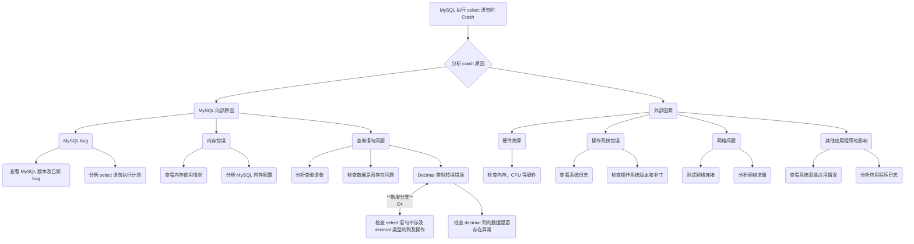

# 目标

在思维链的方案中, 让排查图呈现合理的方式

# 对话

使用以下对话进行测试: 

```
人类：MySQL在执行select语句的时候crash，应该如何排查？
 
人类：错误日志：···
2023-11-06T14:44:05.362128+08:00 0 [Note] /mysql/mysql57/bin/mysqld: ready for connections.
Version: '5.7.36-log' socket: '/mysqldata/mysqltmp/mysqld.sock' port: 16063 MySQL Community Server (GPL)
2023-11-06T14:44:08.710518+08:00 17 [Warning] Timeout waiting for reply of binlog (file: mysqlbinlog.002386, pos: 1397), semi-sync up to file , position 0.
2023-11-06T14:44:08.710580+08:00 17 [Note] Semi-sync replication switched OFF.
06:44:29 UTC - mysqld got signal 8 ;
This could be because you hit a bug. It is also possible that this binary
or one of the libraries it was linked against is corrupt, improperly built,
or misconfigured. This error can also be caused by malfunctioning hardware.
Attempting to collect some information that could help diagnose the problem.
As this is a crash and something is definitely wrong, the information
collection process might fail.key_buffer_size=8388608
read_buffer_size=2097152
max_used_connections=49
max_threads=1000
thread_count=50
connection_count=49
It is possible that mysqld could use up to
key_buffer_size + (read_buffer_size + sort_buffer_size)*max_threads = 6165582 K bytes of memory
Hope that's ok; if not, decrease some variables in the equation.Thread pointer: 0x7f24e0000d40
Attempting backtrace. You can use the following information to find out
where mysqld died. If you see no messages after this, something went
terribly wrong...
stack_bottom = 7f2c930fce98 thread_stack 0x40000
/mysql/mysql57/bin/mysqld(my_print_stacktrace+0x35)[0xf7b545]
/mysql/mysql57/bin/mysqld(handle_fatal_signal+0x4b9)[0x7fab89]
/lib64/libpthread.so.0(+0x134c0)[0x7f332c73d4c0]
/mysql/mysql57/bin/mysqld(decimal2bin+0x1c0)[0x1487e90]
/mysql/mysql57/bin/mysqld(_Z17my_decimal2binaryjPK10my_decimalPhii+0xc5)[0xc916a5]
/mysql/mysql57/bin/mysqld(_ZN10Sort_param12make_sortkeyEPhPKh+0x33d)[0x83bf7d]
/mysql/mysql57/bin/mysqld(Z8filesortP3THDP8FilesortbPyS3_S3+0x1852)[0x83fdc2]
···
 
人类：相关select如下：select a.bank_org_longitude bankOrgLongitude,a.bank_org_latitude bankOrgLatitude,a.visit_range visitRange, b.id id,b.org_name orgName ,b.address address,b.cust_org_code custOrgCode from biz_bank_org_visit_rule a join biz_organization b on a.bank_org_id = b.id where bank_org_longitude is not null and bank_org_latitude is not null and bank_org_id in ( 2056933057096581120 ) ORDER BY ABS(0.000000000000000000000000000000000000000000000000000000000000000000000000000000000000000000000000000000000000000000000000000000000000000000000000000000000000000000000000000000000000000000000000000000000000000000000000000000000000000000000000000000000000000000000000000000000000000000000000000000000000000000000000000000000005-bank_org_longitude)+ABS(0.000000000000000000000000000000000000000000000000000000000000000000000000000000000000000000000000000000000000000000000000000000000000000000000000000000000000000000000000000000000000000000000000000000000000000000000000000000000
``` 

# 生成图的提示词

```
我在解决一个问题, 梳理了一个思考过程

<问题>
...
</问题>

<思考过程> 
...
</思考过程>

我需要你根据以上思考过程 整理出一份问题的排查树(图), 问题在根节点, 下面各节点是各种可能的步骤
``` 

# 第一轮对话的CoT和生成图

```
## MySQL 执行 select 语句时 Crash 的排查训练流程

------

### 对问题的信息进行分析

[对问题的信息进行分析]  目前的信息非常有限，只知道 MySQL 在执行 select 语句时 crash，具体表现、crash 日志、系统环境等信息一概不知。

------

### 需要更多信息

[需要更多信息] 
- MySQL 版本
- 操作系统版本
- 发生 crash 时的错误日志信息
- 导致 crash 的具体 select 语句
- 表结构和数据量
- crash 发生的频率
- 数据库最近是否进行过变更操作（例如升级、配置修改、DDL 等）

[原因] 
这些信息是排查问题的重要线索，可以帮助我们缩小问题范围，更快地定位问题根源。

[如何利用这些信息让答案更聚焦] 

假设获取到以下信息：

- MySQL 版本: 8.0.28
- 操作系统: CentOS 7
- 错误日志信息:  Segmentation fault (core dumped)
- 导致 crash 的 select 语句:  SELECT * FROM users WHERE created_at > '2023-10-26'
- 表结构: users 表包含 id, name, created_at 等字段，数据量约 1000 万行
- crash 发生的频率:  每次执行该 select 语句都会 crash
- 数据库最近进行过变更操作:  无

我们可以根据这些信息进行以下推测：

1. **Segmentation fault** 错误通常表示内存访问错误，可能是 MySQL 代码 bug 导致的。
2.  **每次执行特定 select 语句都会 crash** 表明问题可能与该语句的执行计划、数据读取方式等有关。
3.  结合 MySQL 版本、操作系统版本、表结构和数据量等信息，我们可以缩小问题排查范围，例如查找 MySQL 8.0.28 版本在 CentOS 7 上是否存在已知 bug，或者分析该 select 语句在特定数据量和表结构下的执行计划是否存在问题。

------

### 搜索

[思考] 首先，我们需要了解 MySQL crash 的常见原因有哪些。

[原因]  了解常见原因可以帮助我们更有针对性地进行排查。

[输入搜索引擎的关键字]  MySQL crash 常见原因

[需要搜索的具体问题]
- MySQL 常见的 crash 原因有哪些？
    - [我的搜索结果]  MySQL 常见的 crash 原因包括：内存不足、磁盘空间不足、硬件故障、MySQL bug、操作系统错误、配置文件错误、查询语句错误等。
- MySQL 发生 Segmentation fault 错误的可能原因有哪些？
    - [我的搜索结果]  MySQL 发生 Segmentation fault 错误的可能原因包括：MySQL 代码 bug、内存损坏、第三方库问题、操作系统内核问题等。

------

### 阶段性结论

[思考]  根据搜索结果，MySQL crash 的原因多种多样，我们需要结合具体情况进行分析。

[阶段性答案]  MySQL 在执行 select 语句时 crash，可能是由于多种原因导致的，例如 MySQL bug、内存错误、查询语句问题等。我们需要收集更多信息才能进行更准确的判断。

------

### 反向反思

[假设以上分析是错误的]  如果 crash 不是由 MySQL 本身导致的，那么可能是外部因素导致的。

[原因]  我们需要考虑所有可能性，排除外部因素的干扰。

[输入搜索引擎的关键字]  MySQL 外部因素 crash

[需要搜索的具体问题]
- 哪些外部因素可能导致 MySQL crash？
    - [我的搜索结果]  可能导致 MySQL crash 的外部因素包括：硬件故障（例如内存、磁盘、CPU 等）、操作系统错误（例如内核崩溃、文件系统错误等）、网络问题、其他应用程序的影响等。

------

### 我们应当给人类的回复框架

[我们应当给人类的回复框架] 

1.  **人类现在处于什么情绪**:  推测为焦虑、困惑，因为数据库出现 crash 是比较严重的问题。
2.  **是否应当给出应急的手段**:  应当，例如尝试重启 MySQL 服务，如果可以恢复则先恢复服务，然后再进行问题排查。
3.  **是否应当提示人类下一步动作**:  应当，引导用户收集必要信息，例如错误日志、MySQL 版本、操作系统版本、导致 crash 的 SQL 语句等。
4.  **是否应当给出问题的解**:  不应当，因为目前信息不足，无法给出具体的解决方案，过早给出猜测性的答案可能会误导用户。
5.  **是否应当给出一些扩展的知识**:  可以，在用户收集到足够信息后，可以讲解一些 MySQL crash 的常见原因、排查思路、常用工具等知识。
6.  **在整个过程中, 是否有一些不重要的技术信息, 是不必告诉人类的**:  例如 Segmentation fault 的详细技术细节、MySQL 源代码级别的分析等，这些信息对普通用户帮助不大，反而会增加理解难度。
7.  **在整个过程中, 是否有一些重要的技术信息, 是必须告诉人类的**:  例如 crash 的严重性、数据丢失的风险、如何避免类似问题再次发生等，这些信息可以帮助用户更好地理解问题的本质，并采取必要的措施。
```
```
graph TD
    A[MySQL 执行 select 语句时 Crash] --> B{分析 crash 原因}
    B --> C(MySQL 内部原因)
    C --> C1(MySQL bug)
    C1 --> C11(查看 MySQL 版本及已知 bug)
    C1 --> C12(分析 select 语句执行计划)
    C --> C2(内存错误)
    C2 --> C21(查看内存使用情况)
    C2 --> C22(分析 MySQL 内存配置)
    C --> C3(查询语句问题)
    C3 --> C31(分析查询语句)
    C3 --> C32(检查数据是否存在问题)
    B --> D(外部因素)
    D --> D1(硬件故障)
    D1 --> D11(检查内存、CPU 等硬件)
    D --> D2(操作系统错误)
    D2 --> D21(查看系统日志)
    D2 --> D22(检查操作系统版本和补丁)
    D --> D3(网络问题)
    D3 --> D31(测试网络连接)
    D3 --> D32(分析网络流量)
    D --> D4(其他应用程序的影响)
    D4 --> D41(查看系统资源占用情况)
    D4 --> D42(分析应用程序日志)
``` 

# 第二轮对话

```
------
[对问题的信息进行分析]  人类提供的信息是 MySQL 在执行 select 语句时崩溃，并提供了错误日志。错误日志中包含了以下关键信息：

*  `mysqld got signal 8`：MySQL 服务器进程接收到信号 8 (SIGFPE) 而崩溃，该信号通常表示发生了算术错误，例如除以零。
*  `Semi-sync replication switched OFF`：在崩溃前，MySQL 的半同步复制被关闭。这可能是一个重要的线索，因为半同步复制的关闭通常发生在主库和从库之间出现问题时。
*  `decimal2bin` `my_decimal2binaryjPK10my_decimalPhii`：崩溃发生在与 decimal 数据类型相关的函数调用中，这意味着问题可能与 decimal 类型的处理有关。

------
[思考] 首先，我们需要了解 signal 8 代表什么，以及哪些原因可能导致 MySQL 接收 signal 8 信号。

[原因] 错误日志中显示 MySQL 因为接收到 signal 8 而崩溃，我们需要了解这个信号的含义，才能进一步分析问题的原因。

[输入搜索引擎的关键字] mysql signal 8

[需要搜索的具体问题]
- MySQL 中 signal 8 代表什么？
    -  "Signal 8 is SIGFPE, which stands for "floating-point exception". It is usually caused by an arithmetic error, such as division by zero, overflow, or an invalid arithmetic operation." 
- 哪些原因可能导致 MySQL 接收 signal 8 信号？
    -  "Possible causes of SIGFPE in MySQL include bugs in MySQL code, incompatible libraries, hardware issues (e.g., faulty CPU or memory), data corruption, and issues with user-defined functions or stored procedures that perform arithmetic operations."

------
[阶段性答案] MySQL 因为接收到 signal 8 (SIGFPE) 而崩溃，该信号通常表示发生了算术错误。 导致 MySQL 接收 signal 8 信号的原因有很多，例如 MySQL 代码错误、不兼容的库、硬件问题、数据损坏以及用户自定义函数或存储过程中的算术运算问题等。

------
[思考] 然后，我们需要结合错误日志中提到的 `decimal2bin` 和 `my_decimal2binaryjPK10my_decimalPhii` 函数，进一步分析导致 signal 8 信号的原因。

[原因] 错误日志中显示崩溃发生在与 decimal 数据类型相关的函数调用中，这可能是一个重要的线索。

[输入搜索引擎的关键字] mysql decimal2bin signal 8

[需要搜索的具体问题]
-  调用 `decimal2bin` 和 `my_decimal2binaryjPK10my_decimalPhii` 函数时，哪些情况下可能会出现算术错误？
    - "Arithmetic errors during the execution of `decimal2bin` and `my_decimal2binaryjPK10my_decimalPhii` functions could occur due to issues like attempting to convert an invalid decimal value to binary, overflow during the conversion process, or encountering corrupted data in a decimal column."

------
[阶段性答案] MySQL 在执行 select 语句时崩溃，可能是因为在调用 `decimal2bin` 和 `my_decimal2binaryjPK10my_decimalPhii` 函数进行 decimal 类型转换时发生了算术错误，例如尝试将无效的 decimal 值转换为二进制、转换过程中出现溢出或者 decimal 列中存在损坏的数据等。

------
[需要更多信息]  我们需要更多信息才能更准确地判断和解决问题：
1.  执行的 select 语句是什么？ 
2.  涉及到的表的结构是什么，特别是包含 decimal 类型的列？
3.  最近是否对数据库进行了升级或修改？
4.  能否提供更详细的错误日志？

[原因] 
1.  了解执行的 select 语句可以帮助我们确定哪些列参与了运算，以及是否使用了特定的函数或操作符。
2.  了解表的结构可以帮助我们分析 decimal 列的定义是否合理，数据类型是否匹配。
3.  升级或修改数据库可能会引入新的 bug 或导致不兼容问题。
4.  更详细的错误日志可能包含更多有用的信息，例如具体的错误代码、调用堆栈等。

[如何利用这些信息让答案更聚焦] 
1.  根据 select 语句和表结构，我们可以尝试复现问题，并缩小问题范围。
2.  检查 decimal 列的定义，查看是否设置了合适的精度和标度。
3.  如果最近进行了升级或修改，可以尝试回滚到之前的版本或检查修改的内容。
4.  分析更详细的错误日志，查找更具体的错误信息。

------
[我们应当给人类的回复框架] 
1.  人类现在处于什么情绪：焦急，因为数据库崩溃影响了业务。
2.  是否应当给出应急的手段：应当，例如尝试重启 MySQL 服务，如果问题仍然存在，可以尝试回滚到之前的备份。
3.  是否应当提示人类下一步动作，以减少问题的可能的解：应当，引导人类收集更多信息，例如执行的 SQL 语句、表结构、错误日志等。
4.  是否应当给出问题的解：不应当，因为目前信息不足，无法给出确切的解决方案。
5.  是否应当给出一些扩展的知识，以供人类学习：可以，例如介绍 signal 8 的含义、decimal 类型转换可能出现的错误等。
6.  在整个过程中，是否有一些不重要的技术信息，是不必告诉人类的：可以省略一些底层技术细节，例如 `my_decimal2binaryjPK10my_decimalPhii` 函数的具体实现。
7.  在整个过程中，是否有一些重要的技术信息，是必须告诉人类的：必须告诉人类 signal 8 的含义、decimal 类型转换可能出现的错误，以及收集哪些信息有助于定位问题。
```

```
graph TD
    A((MySQL 执行 Select 语句崩溃)) --> B{分析错误日志}
    B --> C(signal 8 (SIGFPE): 算术错误)
    C --> D{分析可能原因}
    D --> E(MySQL 代码错误)
    D --> F(不兼容的库)
    D --> G(硬件问题)
    D --> H(数据损坏)
    D --> I(用户自定义函数/存储过程问题)
    C --> J{检查 decimal 类型转换}
    J --> K(decimal2bin 和 my_decimal2binaryjPK10my_decimalPhii 函数调用)
    K --> L(无效的 decimal 值转换)
    K --> M(转换过程中溢出)
    K --> N(decimal 列数据损坏)
    A --> O{收集更多信息}
    O --> P(执行的 Select 语句)
    O --> Q(涉及表的结构(特别是 decimal 类型列))
    O --> R(数据库近期升级或修改记录)
    O --> S(更详细的错误日志)
``` 

# 尝试进行图的合并

````
我在解决一个问题, 梳理了一个思考过程
 
<问题>
人类：MySQL在执行select语句的时候crash，应该如何排查？
  
人类：错误日志：```
2023-11-06T14:44:05.362128+08:00 0 [Note] /mysql/mysql57/bin/mysqld: ready for connections.
Version: '5.7.36-log' socket: '/mysqldata/mysqltmp/mysqld.sock' port: 16063 MySQL Community Server (GPL)
2023-11-06T14:44:08.710518+08:00 17 [Warning] Timeout waiting for reply of binlog (file: mysqlbinlog.002386, pos: 1397), semi-sync up to file , position 0.
2023-11-06T14:44:08.710580+08:00 17 [Note] Semi-sync replication switched OFF.
06:44:29 UTC - mysqld got signal 8 ;
This could be because you hit a bug. It is also possible that this binary
or one of the libraries it was linked against is corrupt, improperly built,
or misconfigured. This error can also be caused by malfunctioning hardware.
Attempting to collect some information that could help diagnose the problem.
As this is a crash and something is definitely wrong, the information
collection process might fail.key_buffer_size=8388608
read_buffer_size=2097152
max_used_connections=49
max_threads=1000
thread_count=50
connection_count=49
It is possible that mysqld could use up to
key_buffer_size + (read_buffer_size + sort_buffer_size)*max_threads = 6165582 K bytes of memory
Hope that's ok; if not, decrease some variables in the equation.Thread pointer: 0x7f24e0000d40
Attempting backtrace. You can use the following information to find out
where mysqld died. If you see no messages after this, something went
terribly wrong...
stack_bottom = 7f2c930fce98 thread_stack 0x40000
/mysql/mysql57/bin/mysqld(my_print_stacktrace+0x35)[0xf7b545]
/mysql/mysql57/bin/mysqld(handle_fatal_signal+0x4b9)[0x7fab89]
/lib64/libpthread.so.0(+0x134c0)[0x7f332c73d4c0]
/mysql/mysql57/bin/mysqld(decimal2bin+0x1c0)[0x1487e90]
/mysql/mysql57/bin/mysqld(_Z17my_decimal2binaryjPK10my_decimalPhii+0xc5)[0xc916a5]
/mysql/mysql57/bin/mysqld(_ZN10Sort_param12make_sortkeyEPhPKh+0x33d)[0x83bf7d]
/mysql/mysql57/bin/mysqld(Z8filesortP3THDP8FilesortbPyS3_S3+0x1852)[0x83fdc2]
```
</问题>
 
 
<思考过程>
------
[对问题的信息进行分析]  人类提供的信息是 MySQL 在执行 select 语句时崩溃，并提供了错误日志。错误日志中包含了以下关键信息：
 
*  `mysqld got signal 8`：MySQL 服务器进程接收到信号 8 (SIGFPE) 而崩溃，该信号通常表示发生了算术错误，例如除以零。
*  `Semi-sync replication switched OFF`：在崩溃前，MySQL 的半同步复制被关闭。这可能是一个重要的线索，因为半同步复制的关闭通常发生在主库和从库之间出现问题时。
*  `decimal2bin` `my_decimal2binaryjPK10my_decimalPhii`：崩溃发生在与 decimal 数据类型相关的函数调用中，这意味着问题可能与 decimal 类型的处理有关。
 
------
[思考] 首先，我们需要了解 signal 8 代表什么，以及哪些原因可能导致 MySQL 接收 signal 8 信号。
 
[原因] 错误日志中显示 MySQL 因为接收到 signal 8 而崩溃，我们需要了解这个信号的含义，才能进一步分析问题的原因。
 
[输入搜索引擎的关键字] mysql signal 8
 
[需要搜索的具体问题]
- MySQL 中 signal 8 代表什么？
    -  "Signal 8 is SIGFPE, which stands for "floating-point exception". It is usually caused by an arithmetic error, such as division by zero, overflow, or an invalid arithmetic operation."
- 哪些原因可能导致 MySQL 接收 signal 8 信号？
    -  "Possible causes of SIGFPE in MySQL include bugs in MySQL code, incompatible libraries, hardware issues (e.g., faulty CPU or memory), data corruption, and issues with user-defined functions or stored procedures that perform arithmetic operations."
 
------
[阶段性答案] MySQL 因为接收到 signal 8 (SIGFPE) 而崩溃，该信号通常表示发生了算术错误。 导致 MySQL 接收 signal 8 信号的原因有很多，例如 MySQL 代码错误、不兼容的库、硬件问题、数据损坏以及用户自定义函数或存储过程中的算术运算问题等。
 
------
[思考] 然后，我们需要结合错误日志中提到的 `decimal2bin` 和 `my_decimal2binaryjPK10my_decimalPhii` 函数，进一步分析导致 signal 8 信号的原因。
 
[原因] 错误日志中显示崩溃发生在与 decimal 数据类型相关的函数调用中，这可能是一个重要的线索。
 
[输入搜索引擎的关键字] mysql decimal2bin signal 8
 
[需要搜索的具体问题]
-  调用 `decimal2bin` 和 `my_decimal2binaryjPK10my_decimalPhii` 函数时，哪些情况下可能会出现算术错误？
    - "Arithmetic errors during the execution of `decimal2bin` and `my_decimal2binaryjPK10my_decimalPhii` functions could occur due to issues like attempting to convert an invalid decimal value to binary, overflow during the conversion process, or encountering corrupted data in a decimal column."
 
------
[阶段性答案] MySQL 在执行 select 语句时崩溃，可能是因为在调用 `decimal2bin` 和 `my_decimal2binaryjPK10my_decimalPhii` 函数进行 decimal 类型转换时发生了算术错误，例如尝试将无效的 decimal 值转换为二进制、转换过程中出现溢出或者 decimal 列中存在损坏的数据等。
 
------
[需要更多信息]  我们需要更多信息才能更准确地判断和解决问题：
1.  执行的 select 语句是什么？
2.  涉及到的表的结构是什么，特别是包含 decimal 类型的列？
3.  最近是否对数据库进行了升级或修改？
4.  能否提供更详细的错误日志？
 
[原因]
1.  了解执行的 select 语句可以帮助我们确定哪些列参与了运算，以及是否使用了特定的函数或操作符。
2.  了解表的结构可以帮助我们分析 decimal 列的定义是否合理，数据类型是否匹配。
3.  升级或修改数据库可能会引入新的 bug 或导致不兼容问题。
4.  更详细的错误日志可能包含更多有用的信息，例如具体的错误代码、调用堆栈等。
 
[如何利用这些信息让答案更聚焦]
1.  根据 select 语句和表结构，我们可以尝试复现问题，并缩小问题范围。
2.  检查 decimal 列的定义，查看是否设置了合适的精度和标度。
3.  如果最近进行了升级或修改，可以尝试回滚到之前的版本或检查修改的内容。
4.  分析更详细的错误日志，查找更具体的错误信息。
 
 
------
[我们应当给人类的回复框架]
1.  人类现在处于什么情绪：焦急，因为数据库崩溃影响了业务。
2.  是否应当给出应急的手段：应当，例如尝试重启 MySQL 服务，如果问题仍然存在，可以尝试回滚到之前的备份。
3.  是否应当提示人类下一步动作，以减少问题的可能的解：应当，引导人类收集更多信息，例如执行的 SQL 语句、表结构、错误日志等。
4.  是否应当给出问题的解：不应当，因为目前信息不足，无法给出确切的解决方案。
5.  是否应当给出一些扩展的知识，以供人类学习：可以，例如介绍 signal 8 的含义、decimal 类型转换可能出现的错误等。
6.  在整个过程中，是否有一些不重要的技术信息，是不必告诉人类的：可以省略一些底层技术细节，例如 `my_decimal2binaryjPK10my_decimalPhii` 函数的具体实现。
7.  在整个过程中，是否有一些重要的技术信息，是必须告诉人类的：必须告诉人类 signal 8 的含义、decimal 类型转换可能出现的错误，以及收集哪些信息有助于定位问题。
</思考过程>
 
目前已经有一份排查树如下

<已有的排查树>
graph TD
    A[MySQL 执行 select 语句时 Crash] --> B{分析 crash 原因}
    B --> C(MySQL 内部原因)
    C --> C1(MySQL bug)
    C1 --> C11(查看 MySQL 版本及已知 bug)
    C1 --> C12(分析 select 语句执行计划)
    C --> C2(内存错误)
    C2 --> C21(查看内存使用情况)
    C2 --> C22(分析 MySQL 内存配置)
    C --> C3(查询语句问题)
    C3 --> C31(分析查询语句)
    C3 --> C32(检查数据是否存在问题)
    B --> D(外部因素)
    D --> D1(硬件故障)
    D1 --> D11(检查内存、CPU 等硬件)
    D --> D2(操作系统错误)
    D2 --> D21(查看系统日志)
    D2 --> D22(检查操作系统版本和补丁)
    D --> D3(网络问题)
    D3 --> D31(测试网络连接)
    D3 --> D32(分析网络流量)
    D --> D4(其他应用程序的影响)
    D4 --> D41(查看系统资源占用情况)
    D4 --> D42(分析应用程序日志)
</已有的排查树>

我们认为人类提供了新的信息, 那么排查需要在已有的排查过程中进行深入或修改. 我们希望你将以上的思考过程合并到已有的排查树中.
并且你需要告诉我, 哪些排查树的节点(包括其子树), 因为新信息的引入, 已经不再是我们关注的方向
````
```
##  更新后的排查树以及不再关注的方向

由于新的信息 "错误日志中显示崩溃发生在与 decimal 数据类型相关的函数调用中"， 我们需要调整排查方向，更加关注与 decimal 类型相关的错误。

**更新后的排查树:**

graph TD
    A[MySQL 执行 select 语句时 Crash] --> B{分析 crash 原因}
    B --> C(MySQL 内部原因)
    C --> C1(MySQL bug)
    C1 --> C11(查看 MySQL 版本及已知 bug)
    C1 --> C12(分析 select 语句执行计划)
    C --> C2(内存错误)
    C2 --> C21(查看内存使用情况)
    C2 --> C22(分析 MySQL 内存配置)
    C --> C3(查询语句问题)
    C3 --> C31(分析查询语句)
    C3 --> C32(检查数据是否存在问题)
    C32 --> C321(检查 decimal 类型数据是否存在异常)  
    B --> D(外部因素)
    D --> D1(硬件故障)
    D1 --> D11(检查内存、CPU 等硬件)
    D --> D2(操作系统错误)
    D2 --> D21(查看系统日志)
    D2 --> D22(检查操作系统版本和补丁)
    D --> D3(网络问题)
    D3 --> D31(测试网络连接)
    D3 --> D32(分析网络流量)
    D --> D4(其他应用程序的影响)
    D4 --> D41(查看系统资源占用情况)
    D4 --> D42(分析应用程序日志)

**新增节点解释:**

*   **C321(检查 decimal 类型数据是否存在异常):**  重点关注 select 语句中涉及的 decimal 类型数据，检查是否存在以下问题：
    *   **数据超出精度或标度范围:** 检查表结构中 decimal 类型的定义，确认数据是否超过了定义的精度和标度。
    *   **数据格式错误:**  确认 decimal 类型数据是否符合规范，例如是否存在非数字字符。
    *   **数据损坏:**  使用校验工具检查数据库文件是否存在损坏。

**不再关注的方向:**

由于错误信息明确指向 decimal 类型转换问题，以下排查方向的优先级降低，可以暂时不再关注:

*   **D1(硬件故障):**  硬件故障通常会导致更普遍的错误，而不仅仅是与特定数据类型相关的崩溃。
*   **D2(操作系统错误):**  与硬件故障类似，操作系统错误不太可能导致与特定数据类型相关的崩溃。
*   **D3(网络问题):** 网络问题通常会导致连接中断或延迟，而不是数据库崩溃。
*   **D4(其他应用程序的影响):** 其他应用程序的影响通常表现为资源竞争，而不是特定数据类型的错误。

**需要提醒的是，以上只是根据现有信息进行的初步判断，不排除其他可能性。在实际排查过程中，需要根据具体情况灵活调整策略，并结合更多信息进行分析。**
``` 

  - 新增的节点太少. 
  - 不再关注的方向是正确的.

另一次的输出: 

````
## 更新后的排查树以及不再关注的方向

根据你提供的思考过程和新的信息，我们可以更新排查树，并明确哪些分支不再是我们关注的重点。

**更新后的排查树:**



**不再关注的方向:**

由于错误日志中明确指出崩溃发生在 `decimal2bin` 和 `my_decimal2binaryjPK10my_decimalPhii` 函数调用中，并且与 signal 8 (SIGFPE) 相关，我们可以排除一些不太可能的原因，即以下分支不再是我们关注的重点：

* **D1 硬件故障:** 虽然硬件故障也可能导致 SIGFPE 信号，但结合错误日志中关于 decimal 转换的信息，硬件故障的可能性相对较低。
* **D2 操作系统错误:** 同上，操作系统错误导致 SIGFPE 的可能性也比较低。
* **D3 网络问题:** 网络问题通常不会导致 MySQL 在执行 select 语句时崩溃，更不会与 decimal 类型转换错误相关联。
* **D4 其他应用程序的影响:** 其他应用程序的影响通常表现为资源竞争，而不太可能直接导致 MySQL 内部函数调用出错。

**接下来应该关注的重点:**

* **C4 Decimal 类型转换错误:** 这是目前最可能的原因，需要重点排查 select 语句中涉及 decimal 类型的列和操作，以及 decimal 列的数据是否存在异常。
* **C1 MySQL bug:**  查看 MySQL 版本是否存在已知 bug，特别是与 decimal 类型处理相关的 bug。

**需要收集的额外信息:**

* 执行的 select 语句
* 涉及到的表的结构，特别是包含 decimal 类型的列
* 更详细的错误日志

通过以上分析和信息收集，我们可以更加精准地定位问题，并最终解决 MySQL 崩溃的问题。
```` 

  - 新增节点的方向是对的
  - "不再关注的方向" 是正确的
  - "应该关注的重点" 也是正确的
